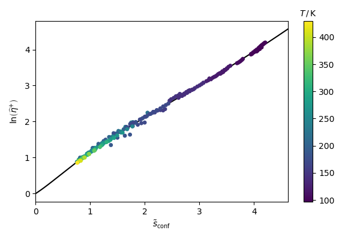
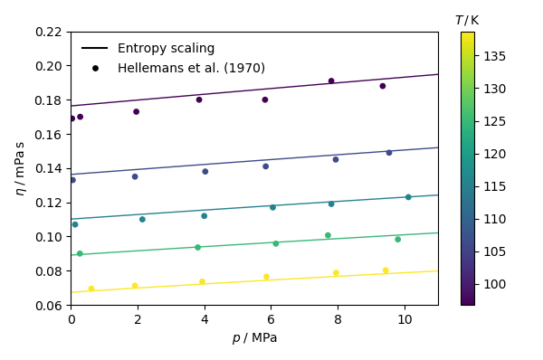

# EntropyScaling

[](https://github.com/se-schmitt/EntropyScaling.jl/actions/workflows/CI.yml?query=branch%3Amaster)

This is an implementation of a general entropy scaling framework intorduced in

S. Schmitt, H. Hasse, S. Stephan, Entropy Scaling Framework for Transport Properties using Molecular-based Equations of State, *Molecular Liquids* (2023) submitted.

## Installation

To register the module locally, type 
```julia
Pkg> add https://github.com/se-schmitt/EntropyScaling
```
in package mode (type `]` to enter to Pkg mode in the REPL).

Then, the module can be loaded by
```julia
using EntropyScaling
```

## Module

The module provides two main functions: `fit_entropy_scaling` and `call_entropy_scaling`.

### Function `fit_entropy_scaling`

**Input**:
- `T::Vector{Float64}`: temperature $T$ vector ($[T] = {\rm K}$) 
- `ϱ::Vector{Float64}`: density $\rho$ vector ($[\rho] = {\rm kg\,m^{-3}}$) 
- `Y::Vector{Float64}`: transport property $Y$ vector, can be
  - viscosity $\eta$ ($[\eta] = {\rm Pa\,s}$)
  - thermal conductivity $\lambda$ ($[\lambda] = {\rm W\,m^{-1}\,K^{-1}}$)
  - self-diffusion coefficient $D$ ($[D] = {\rm m^2\,s^{-1}}$)
- `prop::String`: property string, either `vis` for Viscosity, `tcn` for thermal conductivity, or `D` for self-diffusion coefficient
- `sfun::Function`: function to calculate the entropy $s$ ($[s] = {\rm J\,K^{-1}\,mol^{-1}}$) of the form `sfun(T,\rho,x)` (vectorized)
- `Bfun::Function`: function to calculate the 2nd virial coefficient $B$ ($[B] = {\rm m^3\,mol^{-1}}$) of the form `Bfun(T)` (vectorized)
- `dBdTfun::Function`: function to calculate the temperature derivative of the 2nd virial coefficient ${\rm d} B / {\rm d} T$ ($[{\rm d} B/{\rm d} T] = {\rm m^3\,mol^{-1}\,K^{-1}}$) of the form `dBdTfun(T)` (vectorized)
- `Tc::Float64`: critical temperature $T_{\rm c}$ ($[T_{\rm c}] = {\rm K}$)
- `pc::Float64`: critical pressure $p_{\rm c}$ ($[p_{\rm c}] = {\rm Pa}$)
- `M::Float64`: molar mass $M$ ($[M] = {\rm kg\,mol^{-1}}$)
- `i_fit`: vector determining which parameters of the entropy scaling model should be fitted $(\alpha_{0,i}, \alpha_{{\rm ln},i}, \alpha_{1,i}, \alpha_{2,i}, \alpha_{3,i})$ (if not specified: `i_fit=[0,1,1,1,1]`)
- `m_EOS`: segment number of the applied EOS (if not specified, `m_EOS=1.0`) 

**Output**:
- `α_par`: Fitted component specific parameters $(\alpha_{0,i}, \alpha_{{\rm ln},i}, \alpha_{1,i}, \alpha_{2,i}, \alpha_{3,i})$
- `Yˢ`: CE-scaled transport property (dimensionless), either $\widehat{\eta}^{+}$, $\widehat{\lambda}^{+}$, or $\widehat{D}^{+}$
- `s`: reduced configurational entropy $\tilde{s}_{\rm conf}$

### Function `call_entropy_scaling`

**Input**:
- `T::Vector{Float64}`: temperature $T$ vector ($[T] = {\rm K}$) 
- `ϱ::Vector{Float64}`: density $\rho$ vector ($[\rho] = {\rm kg\,m^{-3}}$) 
- `α_par`: Fitted component specific parameters $(\alpha_{0,i}, \alpha_{{\rm ln},i}, \alpha_{1,i}, \alpha_{2,i}, \alpha_{3,i})$
- `prop::String`: property string, either `vis` for Viscosity, `tcn` for thermal conductivity, or `D` for self-diffusion coefficient
- `x::Matrix{Float64}`: mole fraction matrix (rows: state points, columns: components)
- `sfun::Function`: function to calculate the entropy $s$ ($[s] = {\rm J\,K^{-1}\,mol^{-1}}$) of the form `sfun(T,\rho,x)` (vectorized)
- `Bfun::Vector`: array of functions to calculate the 2nd virial coefficient $B$ ($[B] = {\rm m^3\,mol^{-1}}$) of the form `Bfun(T)` (vectorized)
- `dBdTfun::Vector`: array of function to calculate the temperature derivative of the 2nd virial coefficient ${\rm d} B / {\rm d} T$ ($[{\rm d} B/{\rm d} T] = {\rm m^3\,mol^{-1}\,K^{-1}}$) of the form `dBdTfun(T)` (vectorized)
- `Tc::Float64`: vector of critical temperatures $T_{{\rm c},i}$ ($[T_{\rm c}] = {\rm K}$)
- `pc::Float64`: vector of critical pressures $p_{{\rm c},i}$ ($[p_{\rm c}] = {\rm Pa}$)
- `M::Float64`: vector of molar masses $M_i$ ($[M] = {\rm kg\,mol^{-1}}$)
- `m_EOS`: vector of segment numbers of the applied EOS (if not specified, `m_EOS=1.0`) 

**Output**:
- `Y`: calculated transport property $Y$ vector, can be
  - viscosity $\eta$ ($[\eta] = {\rm Pa\,s}$)
  - thermal conductivity $\lambda$ ($[\lambda] = {\rm W\,m^{-1}\,K^{-1}}$)
  - self-diffusion coefficient $D$ ($[D] = {\rm m^2\,s^{-1}}$)

## Example

The application of the module to methane modeled by the Peng-Robinson (PR) EOS is shown here. The corresponding files are available in the `example` folder.

First, the required packages (including `EntropyScaling`) are loaded and the experimental data are loaded.
```julia
# Implementation of the Peng-Robinson (PR) equation of state for methane
using DelimitedFiles, Roots
using PyCall, PyPlot
using EntropyScaling

# Read experiemntal data
header = split(readline("example/methane_vis.csv"),',')
dat = readdlm("example/methane_vis.csv",',',skipstart=1)
T_exp = Float64.(dat[:,findfirst(header.=="T")])                # K
p_exp = Float64.(dat[:,findfirst(header.=="p")])                # MPa
η_exp = Float64.(dat[:,findfirst(header.=="eta")])              # Pa s
state = dat[:,findfirst(header.=="state")]                      # -
ref = dat[:,findfirst(header.=="shortref")]                     # -
```

Next, the PR EOS is provided with the parameters for methane. Note that no EOS are implemented in this repository. They have to be taken from elsewhere. The densities are implcitly calculated from the EOS function.
```julia
# Parameters for methane
Tc = 190.4                                                      # K
pc = 4.6e6                                                      # Pa
ω = 0.011                                                       # -
M = 0.016043                                                    # kg mol⁻¹

# Load PR equation of state functions
include("PR.jl")
(p_PR, s_PR, B_PR, dBdT_PR) = PR(Tc, pc, ω, M)

# Implicit calculation of density
ϱ_exp = Float64[]
for (i,state_i) in enumerate(state)
    rts = find_zeros(x -> p_PR(T_exp[i],x,1.0) - p_exp[i]*1e6,0,M/(0.07780*EntropyScaling.R*Tc/pc ))
    if state_i in ["G","SCR"]
        push!(ϱ_exp,rts[1])
    else
        push!(ϱ_exp,rts[end])
    end
end
```

Now, the `fit_entropy_scaling` function is executed and the result is plotted in a $\tilde{s}-\widehat{\eta}^{+}$ plot using the `PyPlot` package.
```julia
# Fit entropy scaling
α_CH₄, ηˢ, s = fit_entropy_scaling(T_exp, ϱ_exp, η_exp, "vis"; sfun=s_PR, Bfun=B_PR, dBdTfun=dBdT_PR, Tc=Tc, pc=pc, M=M)

# Plot results
figure()
xs = [0.:0.01:1.1*maximum(s);]
plot(xs,EntropyScaling.fun_es(xs,α_CH₄;prop="vis"),"k-",zorder=0)
scat=scatter(s,log.(ηˢ),c=T_exp,marker="o",s=15,zorder=10)
xlabel(L"\tilde{s}_{\rm conf}",fontsize=10)
ylabel(L"\ln\left(\widehat{\eta}^{+}\right)",fontsize=10)
xlim(minimum(xs),maximum(xs))
cb = colorbar(scat)
cb.ax.set_title(L"T\,/\,{\rm K}",fontsize=10)
tight_layout()
```


At the end, the application of the adjusted parameters is demonstrated by computing muliple isotherms and comparing them to experimental data.
```julia
# Calculation of the viscosity along isotherms
what_ref = ref .== "Hellemans et al. (1970) [A]" .&& T_exp .< 140.0
T_iso = unique(T_exp[what_ref])

# Plot experimental data
figure()
scatter(p_exp[what_ref],η_exp[what_ref].*1e3,marker="o",c=T_exp[what_ref],facecolor="white",s=15.0)
cb = colorbar()
cb.ax.set_title(L"T\,/\,{\rm K}",fontsize=10)

for Ti in T_iso
    what_i = what_ref .&& T_exp .== Ti
    pi = LinRange(0.01,11.0,20)
    coli = get_cmap()((Ti-minimum(T_iso))/(maximum(T_iso)-minimum(T_iso)))
    
    # Implicit calculation of density
    ϱi = Float64[]
    for pj in pi push!(ϱi,find_zeros(x -> p_PR(Ti,x,1.0) - pj*1e6,0,M/(0.07780*EntropyScaling.R*Tc/pc ))[end]) end
    
    # Calculate and plot isotherm
    η_i = call_entropy_scaling(repeat([Ti], length(pi)), ϱi, [α_CH₄], "vis"; sfun=s_PR, Bfun=[B_PR], dBdTfun=[dBdT_PR], Tc=[Tc], pc=[pc], M=[M])
    plot(pi,η_i.*1e3,"-",c=coli,linewidth=1.0)
end
plot(NaN,NaN,"-k",label="Entropy scaling")
scatter(NaN,NaN,marker="o",s=15,c="k",label="Hellemans et al. (1970)")
legend(loc="upper left",fontsize=10,frameon=false)
xlim(0,11)
ylim(0.06,0.22)
xlabel(L"p\;/\;{\rm MPa}",fontsize=10)
ylabel(L"\eta\;/\;{\rm mPa\,s}",fontsize=10)
tight_layout()
```


## Cite

```
@article{entropy_scaling_framework_2023,
    title={Entropy Scaling Framework for Transport Properties using Molecular-based Equations of State},
    author={Sebastian Schmitt, Hans Hasse, and Simon Stephan},
    journal={},
    volume={},
    number={},
    pages={},
    year={2023},
    publisher={},
    doi={},
    url={}
}
```