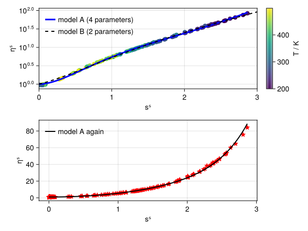

# Getting Started with EntropyScaling.jl

## Installation

The package can be installed by:
```julia
Pkg> add EntropyScaling
```
Package mode can reached by typing `]` in REPL.
Then, the module can be loaded by
```julia
using EntropyScaling
```

## EOS Calculations

The calculation of transport properties through entropy scaling is mostly based on 
fundamental EOS (defined in the Helmholtz energy $a$) as they allow the consistent calculation
of all required thermodynamic properties, in particular the configurational entropy $s_{\rm conf}$. 
The EOS calculations are *not* part of this package.
However, there is an extension to the [`Clapeyron.jl`](https://github.com/ClapeyronThermo/Clapeyron.jl) package,
which provides a large number of different thermodynamic models.
The extension is automatically loaded when loading both packages `EntropyScaling.jl` and `Clapeyron.jl`.
Alternatively, custom thermodynamic models can be used by 'dispatching' the functions defined 
in the [`thermo.jl`](https://github.com/se-schmitt/EntropyScaling.jl/blob/main/src/utils/thermo.jl) file to a custom EOS type.

```julia
using EntropyScaling, Clapeyron

eos_model = PCSAFT("n-butane")
model = FrameworkModel(eos_model,Dict(DynamicViscosity() => [[0.;-14.165;13.97;-2.382;0.501;;]]))
η = dynamicviscosity(model, 37.21e6, 323.)
```

Using `EntropyScaling.jl` in combination with [`Clapeyron.jl`](https://github.com/ClapeyronThermo/Clapeyron.jl)
is the recommended way.

## Units

`EntropyScaling.jl` can be used in combination with [`Unitful.jl`](https://github.com/PainterQubits/Unitful.jl).
This enables both to obtain unitful properties directly from the models and to use data with associated units for fitting models.

1. Unitful calculation of [transport properties](@ref "Transport Properties"). This adds the methods:
    - `dynamic_viscosity(model, p::Pressure, T::Temperature, z=[1.]; phase=:unknown, output=default)`
    - `dynamic_viscosity(model, ϱ::Density, T::Temperature, z=[1.]; output=default)`
    where `::Property` is meta code for unitful values, e.g. `300u"K"` for `T::Temperature`.
    The density can either be mass or molar density.
    The `output` keyword defines the unit of the calculated transport property (see [here](@ref "Transport Properties") for the default values).
2. Defining data for fitting entropy scaling models using units. 
   This supports constructing `TransportPropertyData` using units, 
   e.g. `TransportPropertyData(T::Vector{Temperature}, p::Vector{Pressure}, η::Vector{dynamic_viscosity})`.
   The property-specific constructors (`DynamicViscosityData`, ...) also support units.

In the following, both cases are demonstrated:

```julia
using EntropyScaling, Unitful, Clapeyron, CoolProp

# Calculate unitful transport properties
model_CE = RefpropRESModel("methane")
thermal_conductivity(model, 1u"atm", 80u"°F")
# 0.019529950158013242 W K^-1 m^-1

# Assign units to data for fitting
(_T_exp,_ϱ_exp,_η_exp) = EntropyScaling.load_sample_data();     # Load sample data
T_exp = _T_exp .* 1u"K"
ϱ_exp = _ϱ_exp .* 1u"mol/m^3"
η_exp = _η_exp .* 1u"Pa*s"

data = TransportPropertyData(T_exp, ϱ_exp, η_exp)

eos_model = PCSAFT("butane")
model = FrameworkModel(eos_model, [data])                       # Fit model parameters

η = dynamicviscosity(model, 1u"bar", 26.85u"°C", phase=:liquid, output_unit = u"cP")
# 0.16058971694885213 cP
```

## Plots

Plotting functionality is available through [`Plots.jl`](https://github.com/JuliaPlots/Plots.jl) (which must be loaded).
For example, this can be used for checking fitted models against scaled (experimental) reference data (see example below).

```@docs
EntropyScaling.plot
```

#### Example

In the following example, entropy scaling models are fitted to quasi-experimental data (from CoolProp) and compared.

```julia
using EntropyScaling, Clapeyron, CoolProp, Plots

sub = "propane"
Ndat = 200
T, p = rand(200.:500.,Ndat), 10.0.^(rand(Ndat).*4 .+ 4)     # define T-p state points
η = [PropsSI("V","T",T[i],"P",p[i],sub) for i in 1:Ndat]    # calculate reference dynamic viscosity data

# Create data and model
ηdat = ViscosityData(T,p,[],η)
model_A = FrameworkModel(PCSAFT(sub), [ηdat])
model_B = FrameworkModel(PCSAFT(sub), [ηdat]; opts=FitOptions(what_fit=Dict(DynamicViscosity() => Bool[0,1,0,1,0])))

# Test plot 
plot(model, ηdat; slims=(0,3), cprop=:T, label="Model A (4 parameters fitted)")
plot!(model_B, ηdat; slims=(0,3), cprop=:T, lc=:blue, label="Model B (2 parameters fitted)")
```

