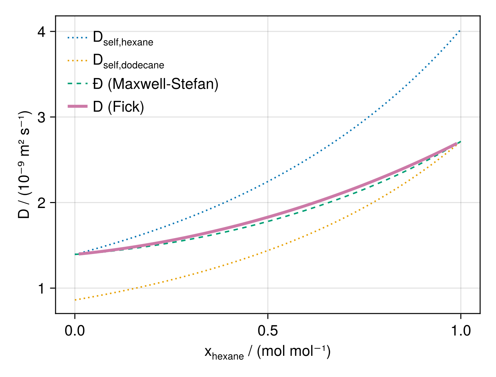

# Summary

{ width=18% }

Transport properties of fluids -- like the viscosity, the thermal conductivity, and diffusion coefficients -- are crucial for the design of various industrial processes.
For example, knowledge of the viscosity is required for accurate fluid dynamics simulations, the thermal conductivity is a central property for modeling heat transfer, and models for diffusion coefficients are used for the rate-based design of separation processes.
Accurate models of the transport properties enable the optimization of these processes in combination with physical simulations.
Conventional methods to model transport properties are often simple correlations that are limited to the scope of the data used in the fitting process.
In contrast, entropy scaling provides a very physical method for modeling transport properties that utilizes the fact that the transport properties, if appropriately reduced, form a univariate function of the residual entropy of the fluid.
This observation can be used to robustly model transport properties in all fluid states (gas, liquid, supercritical) by correlating this univariate function whereas the residual entropy is calculated from fundamental equations of state (EOS).
Fundamental EOS are formulations of the (residual) Helmholtz energy which enable the calculation of all (static) thermodynamic properties.
They are powerful models often used in thermodynamics.
In recent years, several models were developed to model transport properties based on entropy scaling.

The Julia package `EntropyScaling.jl` provides easily accessible implementations of entropy scaling models and thus enables the prediction of transport properties in different states in a physical manner.
It includes predefined models for some fluids, group-contribution models that enable the prediction of transport properties of components without experimental data, as well as methods to fit component-specific models with only a minimal amount of experimental data.
Additionally, `EntropyScaling.jl` includes an implementation of the Chapman-Enskog theory to calculate the transport properties of dilute gases.
The rich thermodynamics library `Clapeyron.jl` [@walker_clapeyronjl_2022] is used as a backend for the EOS calculations.

# Statement of need

`EntropyScaling.jl` is a thermodynamic modeling package for transport properties like the viscosity, thermal conductivity, or diffusion coefficients based on physically sound methods.
Among those, entropy scaling, which is also giving the package its name, enables modeling transport properties in a wide range of different states while only requiring a minimal set of experimental data by exploiting the predictive capabilities of equations of state.
Besides entropy scaling, transport property models for gases based on the Chapman-Enskog theory are implemented.
Through `EntropyScaling.jl`, those methods for modeling transport properties are made available for applications in engineering tasks, e.g. separation processes or heat transfer.
Through Julia's excellent extensibility, the package can easily be coupled with the wider modeling ecosystem.
Moreover, using the strong interoperability with other programming languages (in particular Python), the methods from `EntropyScaling.jl` can also be used in a large number of different applications.

# Key features

## Scope

`EntropyScaling.jl` models the shear viscosity, the thermal conductivity, and diffusion coefficients (self-diffusion, Maxwell-Stefan, and Fick diffusion coefficients) of pure fluids and mixtures.
Because the residual entropy is the only state-dependent input of the scaling function, a single parameter set covers the gas, the liquid, and the supercritical state.
Transport properties are evaluated either from pressure and temperature, in which case the density is obtained from the EOS, or directly from density and temperature.

Besides the property calculations, the package bundles the published parameters of all implemented models in a CSV database, so that models for many common fluids are available without any user input.
Where parameters are missing, a unified fitting interface allows the regression of substance-specific parameters to experimental data; the data handling and the selection of the adjustable parameters are part of this interface.
Fit results can be inspected with the plotting recipes for the characteristic entropy scaling plot, i.e. the scaled transport property as a function of the scaled residual entropy, which are provided for both `Makie.jl` [@danisch_makiejl_2021] and `Plots.jl` [@christ_plotsjl_2023].
Calculations can be performed with physical units through `Unitful.jl` [@noauthor_juliaphysicsunitfuljl_2026], and the implementation supports automatic differentiation [`ForwardDiff.jl`, @revels_forward-mode_2016] as well as symbolic computation [`Symbolics.jl`, @gowda_high-performance_2022], which makes the models usable inside gradient-based optimization and equation-oriented process models.
A coupling to the reservoir simulator `JutulDarcy.jl` [@moyner_jutuldarcyjl_2025] illustrates the use of entropy scaling inside a flow simulation.

## Available Models

The *entropy scaling framework* [@schmitt_entropy_2024; @schmitt_entropy_2025] is the most general model of the package.
It builds on molecular-based EOS (such as PC-SAFT [@gross_perturbed-chain_2001], SAFT-VR Mie, or CPA) and covers all transport properties listed above, including the diffusion coefficients of mixtures.
Its parameters can be fitted to a small number of experimental data points, which makes it the model of choice for fluids not covered by any database.

The *group-contribution entropy scaling* model predicts the viscosity [@lotgering-lin_group_2015] and the thermal conductivity [@hopp_thermal_2019] from the molecular structure alone, using the homosegmented group-contribution PCP-SAFT EOS.
It therefore requires no experimental data for the component of interest.

The *residual entropy scaling* models of @yang_linking_2022 and @martinek_entropy_2025 are combined with the highly accurate multiparameter EOS used in REFPROP and CoolProp [@bell_pure_2014].
They provide viscosities for more than 150 fluids and thermal conductivities for about 40 fluids.

For the zero-density limit, the package implements the *Chapman-Enskog* model of the kinetic gas theory with the collision integrals of @neufeld_empirical_1972 and @kim_high-accuracy_2014, together with the mixing rules of @wilke_viscosity_1950, @mason_approximate_1958, and @miller_self-diffusion_1961.
Lennard-Jones parameters for more than 180 fluids are included [@poling_properties_2001].
Alternatively, a temperature polynomial for the dilute-gas viscosity [@martinek_entropy_2025] is available.

## Examples

The following two examples reproduce results of the underlying publications; the complete scripts are contained in the `examples` folder of the repository.

The first example (\autoref{fig:viscosity}) fits the entropy scaling framework to only 14 experimental viscosity data points of *n*-butane, using PC-SAFT as EOS.
The scaled viscosity collapses onto a single curve (\autoref{fig:viscosity}a), which the model correlates with four parameters.
From this correlation, the model predicts isobars that span more than two orders of magnitude in viscosity and correctly reproduce the discontinuity at the vapor-liquid phase boundary (\autoref{fig:viscosity}b).

The second example (\autoref{fig:diffusion}) shows the diffusion coefficients of the binary mixture *n*-hexane + *n*-dodecane at ambient conditions.
Only the self-diffusion coefficients of the pure components and one binary parameter set are required.
From these, the Maxwell-Stefan diffusion coefficient of the mixture is obtained by entropy scaling, and the Fick diffusion coefficient follows by multiplication with the thermodynamic factor, which the EOS supplies consistently [@schmitt_entropy_2025].

{ width=70% }

# State of the field

There are few packages that implement methods for modeling transport properties.
CoolProp [@bell_pure_2014] implements highly accurate correlations for the viscosity and thermal conductivity of few fluids for which a large number of experimental data exist.
FeOS [@rehner_feos_2023] is a Rust package with a Python frontend for thermodynamic calculations based on molecular equations of state like PC-SAFT EOS [@gross_perturbed-chain_2001].
Additionally, it provides methods for calculating the viscosity, thermal conductivity, and self-diffusion coefficients based on entropy scaling.
Thermo [@bell_thermo_2016] is a general thermodynamic library written in Python that implements, besides other models for static thermodynamic property prediction, some simple correlations for the viscosity and thermal conductivity as well as the Joback group-contribution model [@joback_estimation_1987].
In Clapeyron.jl [@walker_clapeyronjl_2022], only the Joback group contribution is available for predicting the viscosity.

# Software design

`EntropyScaling.jl` is designed as a transport-property layer on top of `Clapeyron.jl` [@walker_clapeyronjl_2022] and adopts its conventions.
Models are constructed from a list of components and an EOS model, parameters are read from CSV files through the `Clapeyron.jl` parameter machinery, and user-defined parameters are passed in the same way as for EOS models.
Consequently, the two packages can be used side by side without any glue code, and all EOS models of `Clapeyron.jl` are available as a backend.

Adding a new entropy scaling model requires little code, because the property functions are generic:
a model only has to define a parameter type and three methods, namely the scaling variable (how the residual entropy is reduced), the scaling function itself, and the scaling of the transport property.
All transport property functions are then obtained for free.
Functionality that pulls in heavy dependencies -- plotting, units, symbolic computation, and the reservoir-simulation coupling -- is implemented in package extensions, which keeps the core of the package lightweight.

# Research impact statement

`EntropyScaling.jl` was used to produce the transport property results of @schmitt_entropy_2025, where entropy scaling was extended to the diffusion coefficients of fluid mixtures.
The package is further used as the transport property backend of `MLThermoProperties.jl` [@schmitt_mlthermopropertiesjl_2025], which combines machine-learning models of thermodynamic properties with `Clapeyron.jl`, and it is coupled to the reservoir simulator `JutulDarcy.jl` through a package extension.
These applications show that the package is usable both as a stand-alone modeling tool and as a component of larger simulation workflows.

# AI usage disclosure

The authors used generative AI tools in the preparation of both this manuscript and the EntropyScaling.jl package.

For the manuscript, AI tools were used to improve the initial draft. All AI-generated text was subsequently reviewed, edited, and integrated by the human authors.

For the software, AI tools provided supporting assistance only: code review, minor tasks, and testing. The design and the main body of the code were written by the authors, and any AI-generated contribution was inspected and tested before inclusion in the repository.

The authors are able to trace and justify all AI-assisted output and are responsible for the final content and its accuracy.

# Acknowledgements

<!-- TODO: funding. Suggested structure:
     The authors gratefully acknowledge funding by <agency> within <program/project>, grant number <no.>.
-->
The authors thank the contributors to `EntropyScaling.jl` and the developers of `Clapeyron.jl` for their support.

# References